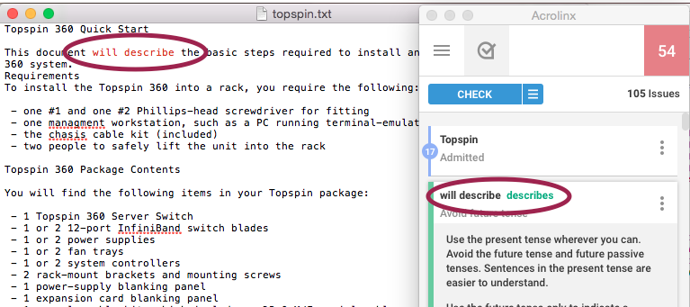
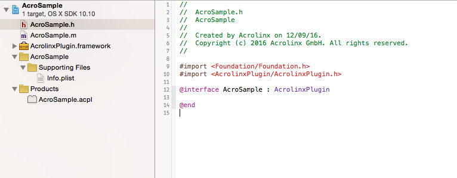
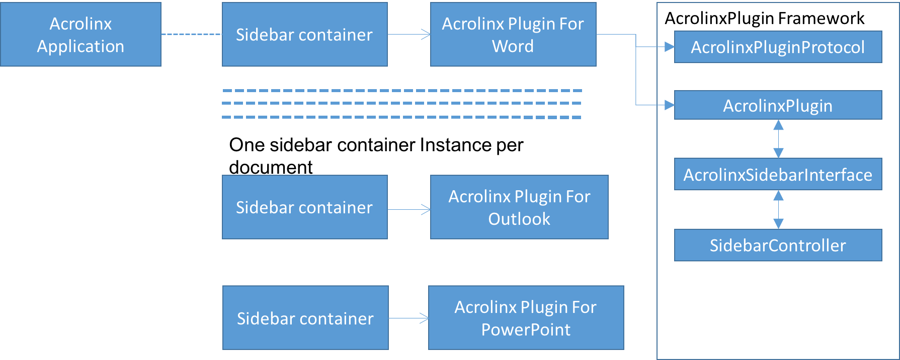

# Acrolinx OS X Sidebar Demo  

This is a showcase for integrating the [Acrolinx](https://www.acrolinx.com/) Sidebar into a Mac OS X Application.

See: [Getting Started with Custom Integrations](https://support.acrolinx.com/hc/en-us/articles/205687652-Getting-Started-with-Custom-Integrations)

## Live Demo

[Acrolinx Sidebar Web Live Demo](https://acrolinx.github.io/acrolinx-sidebar-demo/samples/index.html)

## The Acrolinx Sidebar

The Acrolinx Sidebar is designed to show up beside the window where you edit your content.
You use it for checking, reviewing, and correcting your content.
To get an impression what the Sidebar looks like in existing integrations, have a look at
[Get Started With the Sidebar](https://support.acrolinx.com/hc/en-us/articles/205697451-Get-Started-With-the-Sidebar).

## Prerequisites

Please contact [Acrolinx SDK support](https://github.com/acrolinx/acrolinx-coding-guidance/blob/master/topics/sdk-support.md)
for consulting and getting your integration certified.
This sample works with a test license on an internal Acrolinx URL.
This license is only meant for demonstration and developing purposes.
Once you finished your integration, you'll have to get a license for your integration from Acrolinx.
  
Acrolinx offers different other SDKs, and examples for developing integrations.

Before you start developing your own integration, you might benefit from looking into:

* [Getting Started with Custom Integrations](https://support.acrolinx.com/hc/en-us/articles/205687652-Getting-Started-with-Custom-Integrations),
* the [Guidance for the Development of Acrolinx Integrations](https://github.com/acrolinx/acrolinx-coding-guidance),
* the [Acrolinx SDKs](https://github.com/acrolinx?q=sdk), and
* the [Acrolinx Demo Projects](https://github.com/acrolinx?q=demo).

## Getting Started

### Run Locally

The sample shows how to use the `AcrolinxPlugin.framework` to develop an Acrolinx Integration for the TextEdit application.
To build and run the sample integration, follow these steps:

1. Open `AcrolinxPluginTextEdit.xcodeproject` and build the project in XCode.
2. Copy the output file `AcrolinxPluginTextEdit.acpl` to your `PlugIns`-folder `~/Library/Application Support/PluginIns`
3. Run the Acrolinx application.
4. Open a text file in TextEdit.
   If you create a document, you have to first **save** it for the Acrolinx Integration to work.
   You can also use the test file [`topspin.txt`](doc/topspin.txt).
5. Make sure TextEdit is the active application. Go to the Acrolinx menu, and select "Show Sidebar".
   The "Show Sidebar" menu is enabled only if the file extension is `.txt` or `.rtf`.

   
6. Click on "Show Sidebar" to open the Acrolinx Sidebar.



*Note: If you edit the document manually,
then you have to run another check to update the cards in the Sidebar for highlighting and replacements to work properly.*

### Using the SDK

1. Create an XCode project of type Bundle.
2. Create Cocoa class file.
3. Set Principal Class in project `info.plist` to the given class name.
4. In project build setting, add `AcrolinxPlugin.framework` location in Frame Search Path.
5. For Acrolinx application to identify and load the integration,
   the principal Acrolinx Integration class should be derived from the class `AcrolinxPlugin`.
   It should also implement protocols:
   + `AcrolinxPluginProtocol`, and
   + `AcrolinxSidebarDelegate`.

   
6. The Acrolinx application creates a Sidebar for each document.
   The integration should keep track of the document and its Sidebar.



#### Acrolinx Integration Identification

1. The Acrolinx application loads all supported integrations from the `~/Library/Application Support/PluginIns` folder.
2. To be recognized as supported integration, the principal class must be a sub class of `AcrolinxPlugin`.
3. It also must conform to the protocols:
   + `AcrolinxPluginProtocol`, and
   + `AcrolinxSidebarDelegate`.

#### Application for Mac

The Acrolinx Application provides to show the Sidebar for an open document in any number of editors like Microsoft Word.
You can show a Sidebar only for those applications for which an Acrolinx Integration is installed.

#### Framework

`AcrolinxPlugin.framework` helps you develop an Acrolinx Integration for different applications.
The framework is available in this repository in the [`AcrolinxPluginSDKForMac`](AcrolinxPluginSDKForMac/)-folder.

#### Loading Sidebar

* The Acrolinx application continuously queries for a currently active application.
* Depending on the `frontmostFilePath` of the active document, the Application chooses the Integration.
* To enable the "Show Sidebar" menu, the front-most files extension must be in the `supportedExtensions` list of the Integration.
* When a user selects "Show Sidebar", Acrolinx does the following:
  1. Creates appropriate `plugin`-object
  2. Instantiates the `AcrolinxSidebarController` and sets the `plugin` objects delegate.
  3. Calls `openFileAtPath` method. The integration should use file path for future reference.
  4. Calls `loadSidebarURL`. The integration should pass the Sidebar URL to the `sidebarController` for loading.
* To initialize the Sidebar, the `plugin` should implement `AcrolinxSidebarDelegate` method `sidebarLoaded`.
* Typical implementation of `sidebarLoaded` looks like this:

  ```objectivC
  #pragma mark - AcrolinxSidebarDelegate
  - (void)sidebarLoaded {
      NSMutableDictionary *sidebarOptions = [self createSidebarOptionsForPlugin];

      // Parameter to make the sidebar read only.
      //[sidebarOptions setValue:@"true" forKey:@"readOnlySuggestions"];

      [[[self sidebarController] JSInterface] initializeSidebarWithOptions:sidebarOptions];
  }
  ```

* If needed, the integration can add more option keys like "readOnlySuggestions".

#### Extraction

* When user clicks "Check" in the Sidebar, the `AcrolinxSidebarInterface` gets a request to initiate check.
* The integrations principal class must implement `AcrolinxPluginProtocol` method `startGlobalCheck`.
* The integration is expected to extract the content of the associated document.
  The extracted content must be handed over to the `AcrolinxSidebarInterface` instance.

  ```objectivC
  [[[self sidebarController] JSInterface] performGlobalCheck:stringExtractedFromEditor];
  ```

##### Check Selection

To enable Check Selection in the demo code, perform following steps:

* Open file `AcrolinxPluginTextEdit.m` and uncomment the code in the method `getSelectedContent`.
* Set the check selection key to `true` in method `checkSelectionSupported` and build TextEdit integration.
* Before running Acrolinx application, enables its accessibility. This is needed as selection works on system events.
* Tick the option of Acrolinx Application (`System Preferences` -> `Security and Privacy` -> `Privacy` -> `Accessibility`).
* Save these settings and then run check selection.

#### Lookup

* The Acrolinx Integration's principal class should implement `AcrolinxSidebarDelegate` methods:
    + `sidebarDidSelectWithMatches`, and
    + `sidebarDidReplaceWithReplacements`.
* When the user selects a card in Sidebar, these methods are called accordingly for highlighting or replacement.
* Parameter is an array of dictionaries that holds: content, range, and replacements.
* The offsets correspond to the content submitted as check.
* The Integration has the responsibility to map these ranges to the actual ranges in the document.

## SDK Features

## References

* See [`doc/com.acrolinx.AcrolinxPlugin-Framework.docset`](doc/com.acrolinx.AcrolinxPlugin-Framework.docset)
  for the Acrolinx Framework Class Reference.
* The Sidebar SDKs are based on the [Acrolinx Sidebar Interface](https://acrolinx.github.io/sidebar-sdk-js/).

## License

Copyright 2015-present Acrolinx GmbH

Licensed under the Apache License, Version 2.0 (the "License");
you may not use this file except in compliance with the License.
You may obtain a copy of the License at:

[http://www.apache.org/licenses/LICENSE-2.0](http://www.apache.org/licenses/LICENSE-2.0)

Unless required by applicable law or agreed to in writing, software
distributed under the License is distributed on an "AS IS" BASIS,
WITHOUT WARRANTIES OR CONDITIONS OF ANY KIND, either express or implied.
See the License for the specific language governing permissions and
limitations under the License.

For more information visit: [https://www.acrolinx.com](https://www.acrolinx.com)